# BoltFood-Clone
Decided to build a few screens of one of my favourite apps BoltFood.

### Note ⚙️
The application was built using: 
* Xcode 12.5.1
* Swift 5.6
* macOS Big Sur 11.5.2

### Core Technologies 📲
* Swift
* Programmatic UI
* Protocol Delegation

# Screenshots
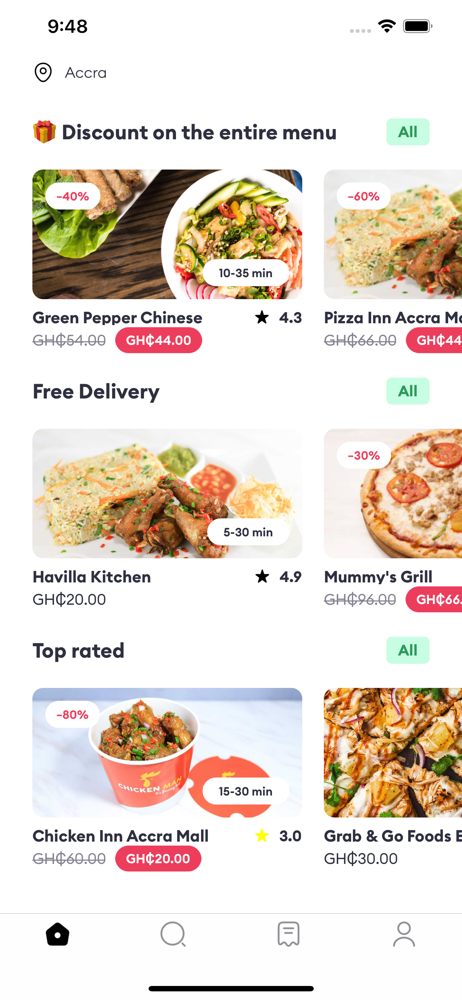
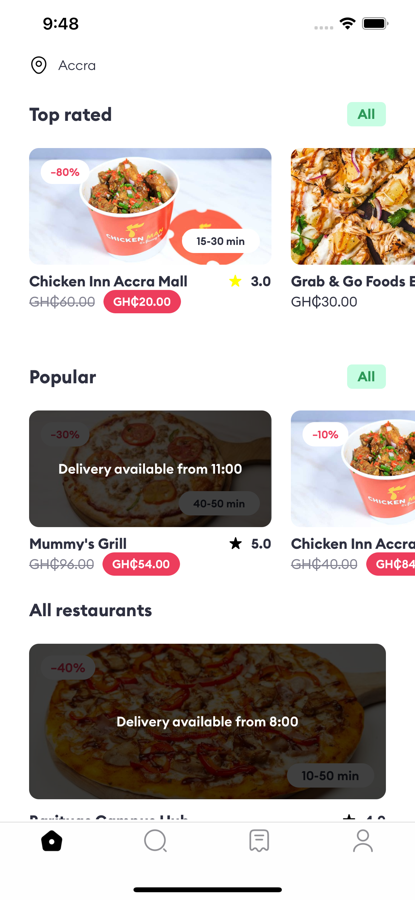

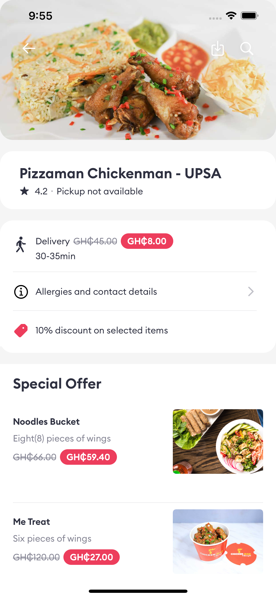
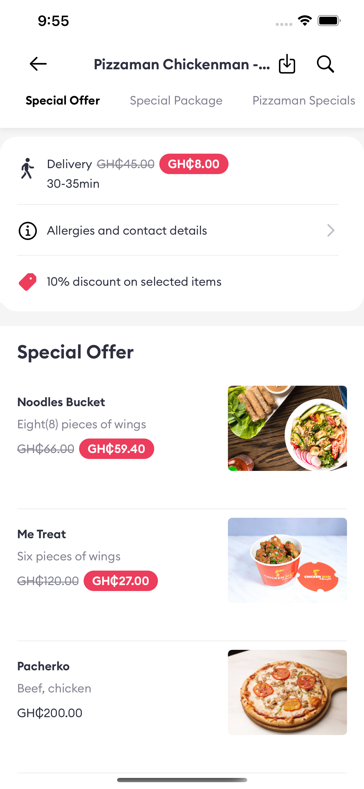
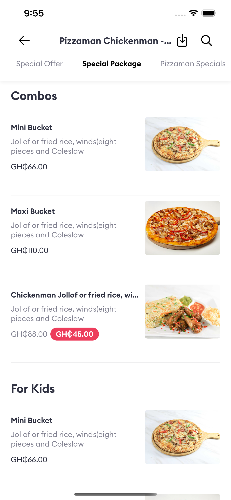

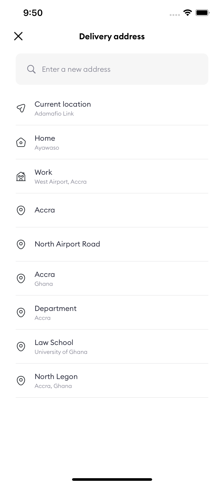
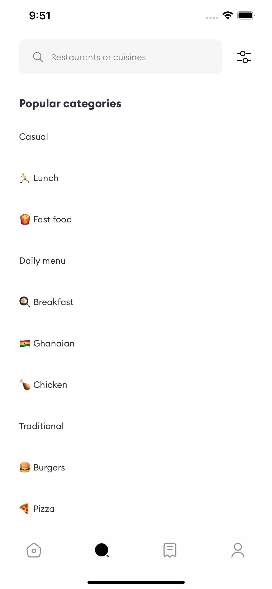
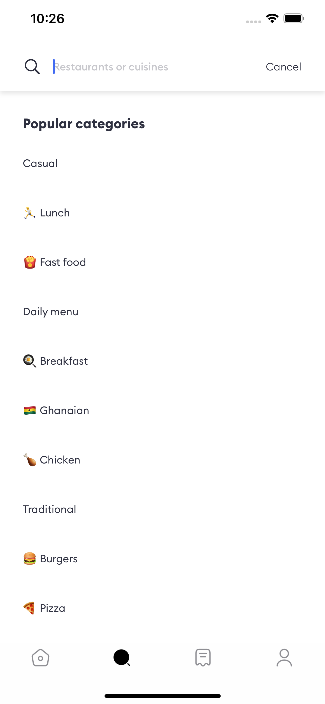

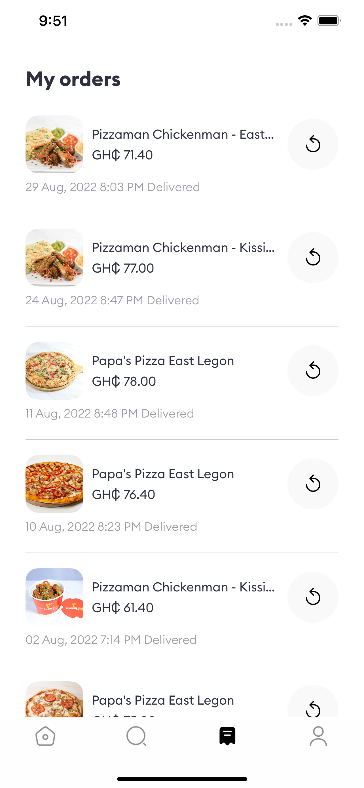
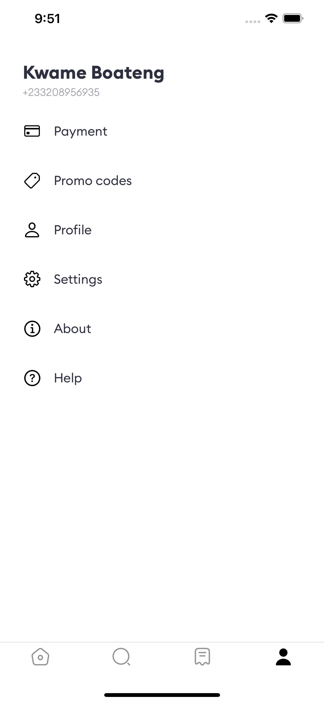
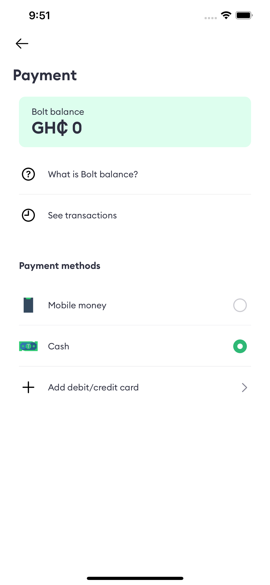

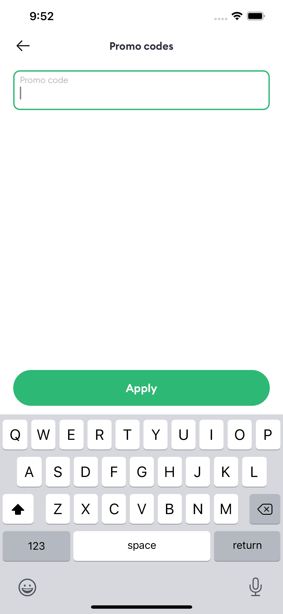
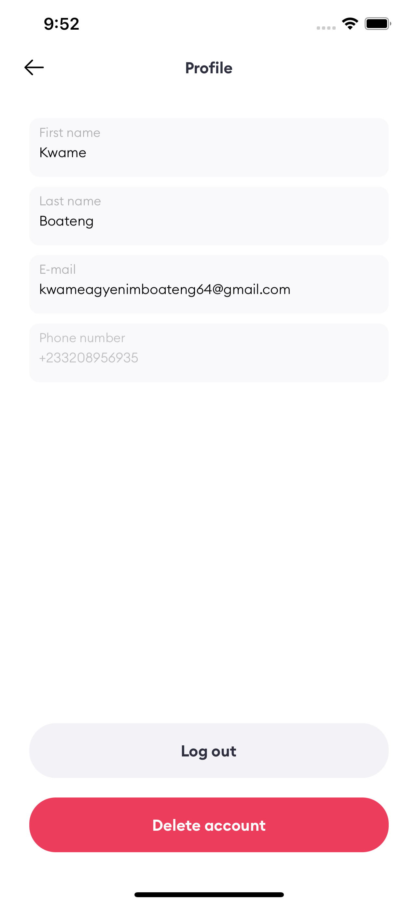

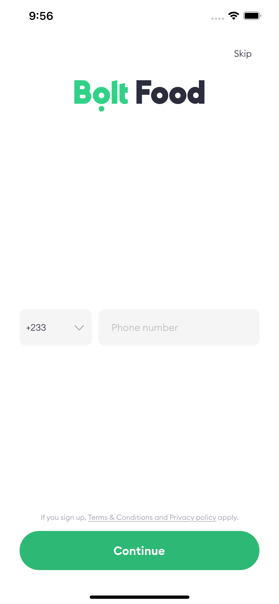
